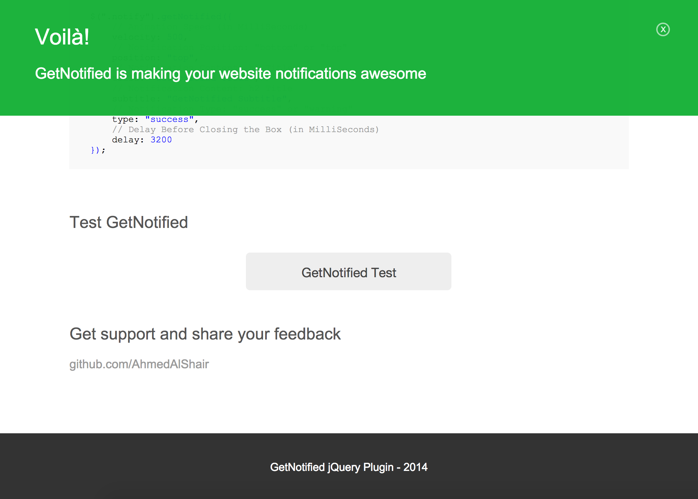

getNotified
===========

A simple and effective jQuery plugin to view notification on your website.


Features
--------
        
   * Easy to integrate in your website pages.
   * All you need are two simple lines of code.
   * Felixible options to take control of what you need to show.
   * Separate stylesheet for the plugin, so you can edit styles easily.
   * Promising to add more features and options in the upcoming versions.
   
   



How to use?
-----------

Include the ```getNotified.css``` in your page:

```css
<link type="text/css" rel="stylesheet" href="getNotified.css">
```


Include the ```getNotified.js``` after the jQuery script tag:

```html
<script src="jquery.js"></script>
<script src="getNotified.js"></script>
```


Add a ```div``` having ```.getNotifiedBox``` class to your html code:

```html
<div class='getNotifiedBox'></div>
```


In a script tag ```<script>``` or in your page ```.js``` file, call the function ```getNotified();``` for the target element

```javascript
$(".notify").getNotified();
```


You can customize getNotified simply by passing arguments:

```javascript
$(".notify").getNotified({
    // Animation Speed (in MilliSeconds)
    velocity: 500,
    // Notification Position: "bottom" or "top"
    position: "top",
    // Notification Content: h1 Title
    title: "GetNotified Title",
    // Notification Content: h2 Title
    subtitle: "GetNotified Subtitle",
    // Notification Type: "success" or "warning"
    type: "success",
    // Delay Before Closing the Box (in MilliSeconds)
    delay: 3200
});
```


Your feedback and comments are appreciated..


